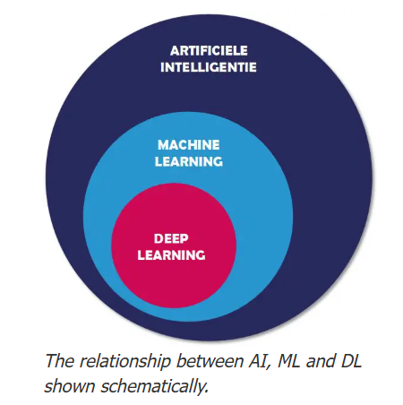

---


---

<!-- _class: divider -->

## 1. Introduction to Data Analytics and Data Science

---

# ความสำคัญของข้อมูลในองค์กรยุคดิจิทัล
- ข้อมูล = ทรัพยากรที่มีค่าที่สุดขององค์กร
- ช่วยให้เข้าใจภาคอุตสาหกรรม แนวโน้มการผลิต และประสิทธิภาพการดำเนินงาน
- **ประโยชน์หลัก:**
  - วางแผนนโยบายมาตรฐานและอุตสาหกรรม
  - เพิ่มประสิทธิภาพการตรวจสอบและรับรอง
  - ลดต้นทุนและความเสี่ยงด้านคุณภาพ
  - สร้างความโปร่งใสและธรรมาภิบาล

**สถิติ:** องค์กรที่ใช้ Data-Driven Decision Making มี productivity สูงขึ้น 5–6%

---

# DIKW Pyramid — ลำดับชั้นของข้อมูล

- **Data:** ข้อเท็จจริงดิบ เช่น ตัวเลขผลผลิตอ้อยแต่ละแปลง
- **Information:** ข้อมูลที่ผ่านการจัดระเบียบ เช่น ผลผลิตรวมรายจังหวัด
- **Knowledge:** การตีความ เช่น จังหวัดที่มีผลผลิตสูงมักมี มอก.
- **Wisdom:** การนำไปใช้ตัดสินใจ เช่น กำหนดนโยบายส่งเสริม มอก.

---

# Data Analytics vs Data Science

| Data Analytics | Data Science |
|---|---|
| วิเคราะห์ข้อมูลในอดีต | ครอบคลุมอดีต ปัจจุบัน และอนาคต |
| สถิติ + Visualization | ML + AI ขั้นสูง |
| "เกิดอะไรขึ้น" / "ทำไม" | "จะเกิดอะไรขึ้น" / "ควรทำอย่างไร" |
| Tools: Excel, SQL, BI | Tools: Python, R, ML Frameworks |

**Data Science** = Data Analytics + Machine Learning + Domain Knowledge

---

# 4 ระดับของการวิเคราะห์ข้อมูล

| ระดับ | คำถามหลัก | วิธีการ | มูลค่า |
|---|---|---|---|
| **Descriptive** | เกิดอะไรขึ้น? | สถิติ, Visualization, Dashboard | ✅ |
| **Diagnostic** | ทำไมจึงเกิด? | Drill-down, Correlation, Root Cause | ✅✅ |
| **Predictive** | จะเกิดอะไรขึ้น? | Regression, Classification, ML | ✅✅✅ |
| **Prescriptive** | ควรทำอย่างไร? | Optimization, Simulation, Decision Trees | ✅✅✅✅ |


---

# CRISP-DM Framework

1. **Business Understanding** — ทำความเข้าใจธุรกิจ/นโยบาย
2. **Data Understanding** — รวบรวมและสำรวจข้อมูล
3. **Data Preparation** — เตรียมและทำความสะอาดข้อมูล
4. **Modeling** — สร้างโมเดล
5. **Evaluation** — ประเมินผล
6. **Deployment** — นำไปใช้งาน

**หมายเหตุ:** CRISP-DM เป็น iterative — สามารถย้อนกลับไปขั้นก่อนหน้าได้

---

# บทบาทของข้อมูลในการสนับสนุนการตัดสินใจ

**Data-Driven Decision Making**

- **เชิงนโยบาย** — กำหนดมาตรฐานอุตสาหกรรม, วางแผนการผลิตอ้อย
- **เชิงปฏิบัติการ** — จัดสรรทรัพยากรตรวจสอบ, บริหารปริมาณอ้อยเข้าหีบ
- **เชิงยุทธศาสตร์** — กำหนดเขตอุตสาหกรรม, วางแผนส่งออกน้ำตาล

| แนวทาง | ลักษณะ | ความเสี่ยง |
|---|---|---|
| Intuition-based | ใช้ประสบการณ์ล้วน | สูง |
| Data-informed | ข้อมูลประกอบการตัดสินใจ | ปานกลาง |
| Data-driven | ข้อมูลนำการตัดสินใจ | ต่ำที่สุด |

---

# ตัวอย่างการประยุกต์ใช้

| หน่วยงาน | การประยุกต์ใช้ |
|---|---|
| สมอ. | วิเคราะห์แนวโน้มการขอ มอก., พยากรณ์ความเสี่ยงสินค้าไม่ได้มาตรฐาน |
| สมอ. | Data Dashboard สถานะการตรวจรับรองโรงงาน |
| สำนักงานอ้อย | พยากรณ์ผลผลิตอ้อยรายฤดู, วิเคราะห์ราคาน้ำตาล |
| สำนักงานอ้อย | วางแผนการจัดสรรปริมาณอ้อยให้โรงงาน |

---

<!-- _class: divider -->
## 2. Data Types

---

# ประเภทของข้อมูล

**Structured** — ฐานข้อมูลทะเบียนโรงงาน, ผลตรวจ มอก., ปริมาณอ้อย yield
**Semi-Structured** — JSON จาก API กรมศุลกากร, XML รายงานห้องปฏิบัติการ
**Unstructured** — รูปภาพการตรวจสอบ, รายงานผู้ตรวจประเมิน, เอกสารมาตรฐาน
**สัดส่วนในองค์กร:** Structured 20% · Semi-Structured 10% · Unstructured 70%

---

# ตัวอย่าง JSON — ข้อมูลการตรวจ มอก.

```json
{
  "cert_no": "มอก.123-2565",
  "manufacturer": "บริษัท ABC จำกัด",
  "status": "ผ่าน",
  "test_date": "2025-06-01",
  "test_results": [
    {"parameter": "ความแข็งแรง", "result": "ผ่าน"},
    {"parameter": "ขนาด", "result": "ผ่าน"}
  ]
}
```

---

# แหล่งที่มาของข้อมูล

| ภายในองค์กร | ภายนอกองค์กร |
|---|---|
| ฐานข้อมูลทะเบียนผู้ประกอบการ | API กรมศุลกากร |
| ระบบตรวจสอบและรับรอง | ข้อมูลอุตสาหกรรมรายจังหวัด |
| ระบบสารบรรณและเอกสาร | Open Data กระทรวงเกษตร |
| ข้อมูลประวัติการตรวจประเมิน | การสำรวจพื้นที่เพาะปลูก |

---

# ตัวอย่าง — โหลดข้อมูลด้วย Python

```python
import pandas as pd
import requests

# Internal: ทะเบียนผู้ประกอบการ
factory = pd.read_csv("factory_registration.csv")

# External API: กรมศุลกากร (สมมติ)
resp = requests.get("https://api.customs.go.th/trade/sugar")
trade_data = resp.json()

# External: ข้อมูลเกษตร
agri = pd.read_excel("cane_production_2025.xlsx")
```

[](https://github.com/ekaratnida/Applied-machine-learning/tree/master/ai_proj)

---

# คุณภาพข้อมูล (Data Quality Dimensions)

| มิติ | คำอธิบาย | ตัวอย่างใน สมอ./อ้อย |
|---|---|---|
| **Accuracy** | ข้อมูลถูกต้องตรงความจริง | ทะเบียนโรงงานตรงกับสถานที่จริง |
| **Completeness** | ข้อมูลครบถ้วนสมบูรณ์ | ไม่มี missing ค่า CCS ของอ้อย |
| **Consistency** | ข้อมูลสอดคล้องกัน | รหัสจังหวัดตรงกันทั้ง 2 หน่วยงาน |
| **Timeliness** | ข้อมูลทันสมัย | ข้อมูล มอก. อัปเดตภายใน 24 ชม. |
| **Validity** | ข้อมูลอยู่ในรูปแบบที่ถูกต้อง | เลข มอก. ตรงตาม format ที่กำหนด |
| **Uniqueness** | ไม่มี duplicate | โรงงาน 1 แห่งมีทะเบียนเดียว |

---

# Data Preprocessing — ขั้นตอนเตรียมข้อมูล

1. **Data Cleaning** — จัดการ missing values, outliers, duplicates
2. **Data Integration** — รวมข้อมูลจากหลายแหล่ง
3. **Data Transformation** — Normalize, Encode, Feature Engineering
4. **Data Reduction** — เลือก feature ที่สำคัญ, dimensionality reduction
5. **Data Discretization** — แปลงข้อมูลต่อเนื่องเป็นกลุ่ม

---

# แนวทางการจัดเก็บและบริหารจัดการข้อมูล

**Data Governance:**
- **Data Quality** — ความถูกต้อง สมบูรณ์ สอดคล้อง
- **Data Security** — ควบคุมการเข้าถึง เข้ารหัสข้อมูล
- **Data Privacy** — ปฏิบัติตาม PDPA
- **Lifecycle Management** —> สร้าง -> เก็บ -> ใช้ -> ทำลาย
**เทคโนโลยี:** Data Warehouse · Data Lake · Data Lakehouse

---

# ตัวอย่าง — Data Quality Check

```python
df = pd.read_csv("certification_data.csv")

print(" Missing values:\n", df.isnull().sum())
print(" Duplicates:", df.duplicated().sum())
print(" Shape:", df.shape)
print(" Data types:\n", df.dtypes)

# ตรวจสอบวันที่
df["cert_date"] = pd.to_datetime(df["cert_date"])
print(" Date range:", df["cert_date"].min(), "–", df["cert_date"].max())
```

---

# กรณีศึกษา: การตรวจสอบมาตรฐาน มอก.

**โจทย์:** โรงงานที่ได้รับ มอก. แล้วมีอัตราการทวนซ้ำเพื่อขอต่ออายุเพิ่มขึ้น

| ข้อมูลที่ใช้ | ประเภท |
|---|---|
| ทะเบียน มอก. และวันหมดอายุ | Structured |
| รายงานผลตรวจห้องปฏิบัติการ | Semi-Structured |
| ภาพถ่ายกระบวนการผลิต | Unstructured |

**ผลลัพธ์:** พบว่าโรงงาน SMEs ขาดความรู้ในการรักษาระบบคุณภาพ
**แนวทางแก้ไข:** จัดอบรมให้ความรู้ก่อนวันหมดอายุ 3 เดือน + ระบบเตือนอัตโนมัติ

---

<!-- _class: divider -->

## 3. Descriptive Analytics

---

# หลักการวิเคราะห์เชิงพรรณนา

**ตอบคำถาม:** "เกิดอะไรขึ้น?" (What happened?)

**ขั้นตอน:**
1. รวบรวมข้อมูลจากแหล่งต่าง ๆ
2. ทำความสะอาดข้อมูล (Data Cleaning)
3. สรุปข้อมูลด้วยสถิติพื้นฐาน
4. สร้าง Visualization
5. ตีความและสรุปผล

---

# เครื่องมือทางสถิติที่ใช้ใน Descriptive Analytics

| กลุ่ม | ตัวอย่าง |
|---|---|
| Central Tendency | Mean, Median, Mode |
| Dispersion | Range, Variance, Std Dev, IQR |
| Distribution | Frequency, Histogram, Skewness |
| Relationship | Correlation, Cross-tabulation |

---

# ประเภทของตัวแปร (Variable Types)

| ประเภท | คำอธิบาย | ตัวอย่าง |
|---|---|---|
| **Numerical (ตัวเลข)** | | |
| — Continuous | ค่าต่อเนื่อง | ปริมาณอ้อย (กก.), ราคาน้ำตาล (บาท) |
| — Discrete | ค่าไม่ต่อเนื่อง | จำนวนโรงงาน, จำนวน มอก. |
| **Categorical (หมวดหมู่)** | | |
| — Nominal | ไม่มีลำดับ | จังหวัด, ประเภทอุตสาหกรรม |
| — Ordinal | มีลำดับ | ระดับคุณภาพ (ดี/ปานกลาง/ต้องปรับปรุง) |

**ข้อควรจำ:** ชนิดของตัวแปรกำหนดวิธีการวิเคราะห์ที่เหมาะสม

---

# การแจกแจงความถี่ (Frequency Distribution)

**ความถี่สัมบูรณ์ (Absolute Frequency):** จำนวนครั้งที่ค่าปรากฏ
**ความถี่สัมพัทธ์ (Relative Frequency):** สัดส่วนเมื่อเทียบกับทั้งหมด
**ความถี่สะสม (Cumulative Frequency):** ผลรวมความถี่สะสมจากน้อยไปมาก

**ตัวอย่าง — การแจกแจงผลผลิตอ้อย:**
| ช่วงผลผลิต (กก./ไร่) | ความถี่ (จำนวนแปลง) | ร้อยละ | สะสม |
|---|---|---|---|
| < 8,000 | 25 | 12.5% | 12.5% |
| 8,000–10,000 | 68 | 34.0% | 46.5% |
| 10,000–12,000 | 72 | 36.0% | 82.5% |
| > 12,000 | 35 | 17.5% | 100% |

---

# การวัดแนวโน้มเข้าสู่ส่วนกลาง

**Mean (ค่าเฉลี่ย)** — ผลรวม / จำนวน
- ข้อดี: ใช้ข้อมูลทุกค่า
- ข้อเสีย: อ่อนไหวต่อ outlier

**Median (มัธยฐาน)** — ค่ากึ่งกลาง
- ข้อดี: ไม่ได้รับผลจาก outlier
- ใช้เมื่อข้อมูลเบ้ (skewed)

---

# การวัดแนวโน้มเข้าสู่ส่วนกลาง (ต่อ)

**Mode (ฐานนิยม)** — ค่าที่ปรากฏบ่อยที่สุด
- ใช้กับข้อมูล categorical ได้

**ตัวอย่าง:** วิเคราะห์ปริมาณอ้อยเฉลี่ยต่อไร่ของเกษตรกร

---

# ตัวอย่าง — Central Tendency ใน Python

```python
import pandas as pd

df = pd.read_csv("cane_production.csv")

mean_yield = df["yield_per_rai"].mean()
median_rai = df["yield_per_rai"].median()
mode_rai = df["yield_per_rai"].mode()[0]

print(f"Mean yield:   {mean_yield:.2f} กิโลกรัม/ไร่")
print(f"Median yield: {median_rai:.2f} กิโลกรัม/ไร่")
print(f"Mode yield:   {mode_rai:.2f} กิโลกรัม/ไร่")

# Mean vs Median บอกอะไร?
if mean_yield > median_rai:
    print("มีเกษตรกรบางรายได้ผลผลิตสูงมาก (เบ้ขวา)")
elif mean_yield < median_rai:
    print("เกษตรกรส่วนใหญ่ได้ผลผลิตต่ำ (เบ้ซ้าย)")
else:
    print("กระจายตัวสมมาตร")
```

---

# การวัดการกระจายของข้อมูล

**Range (พิสัย)** — สูงสุด - ต่ำสุด
- ง่ายแต่ไม่ทนต่อ outlier

**Variance (ความแปรปรวน)** — ค่าเฉลี่ยของ (ส่วนเบี่ยงเบน)²
- σ² = Σ(xᵢ - μ)² / N

---

# การวัดการกระจายของข้อมูล (ต่อ)

**Standard Deviation (ส่วนเบี่ยงเบนมาตรฐาน)** — √Variance
- หน่วยเดียวกับข้อมูลเดิม
- 68-95-99.7 Rule: µ±1σ=68%, µ±2σ=95%, µ±3σ=99.7%

**IQR** — Q3 - Q1
- ใช้หาค่า outlier: Q1 - 1.5×IQR หรือ Q3 + 1.5×IQR

---

# การแจกแจงของข้อมูล (Distribution)

**Normal Distribution (การแจกแจงปกติ)**
- ข้อมูลสมมาตร Mean = Median = Mode
- เช่น น้ำหนักบรรจุของสินค้าที่ได้มาตรฐาน

**Skewed Distribution (การแจกแจงเบ้)**
- **เบ้ขวา** Mean > Median (ค่าสูงผิดปกติบางค่า)
- **เบ้ซ้าย** Mean < Median (ค่าต่ำผิดปกติบางค่า)
- เช่น การกระจายของรายได้เกษตรกร

---

# ตัวอย่าง — Dispersion ใน Python

```python
# วิเคราะห์การกระจายของราคาน้ำตาล
prices = df["sugar_price"]

print(f"Std Dev: {prices.std():,.2f}")
print(f"Variance: {prices.var():,.2f}")
Q1 = prices.quantile(0.25)
Q3 = prices.quantile(0.75)
iqr = Q3 - Q1
print(f"IQR: {iqr:,.2f}")

# ตรวจจับราคาที่ผิดปกติ (Outlier)
lower = Q1 - 1.5 * iqr
upper = Q3 + 1.5 * iqr
outliers = df[(prices < lower) | (prices > upper)]
print(f"Outlier found: {len(outliers)} เดือน")
```


---

# สถิติพื้นฐานเพื่อการวิเคราะห์

| เครื่องมือ | การใช้งาน |
|---|---|
| Correlation Analysis | ผลิตอ้อยสัมพันธ์กับปริมาณน้ำฝนหรือไม่? |
| Cross-Tabulation | จำนวน มอก. แยกตามประเภทอุตสาหกรรม |
| Trend Analysis | แนวโน้มการส่งออกน้ำตาล 5 ปี |

**ตัวอย่าง:** ความสัมพันธ์ระหว่างปริมาณน้ำฝนกับผลผลิตอ้อย:
```python
corr = df["rainfall_mm"].corr(df["yield_per_rai"])
print(f"r = {corr:.3f}")
# r > 0  ฝนมาก ผลผลิตมากขึ้น
# r < 0  ฝนมาก ผลผลิตลดลง (น้ำท่วม)
# r ≈ 0  ไม่สัมพันธ์กัน
```

---

# หลักการของ Correlation

| ค่า r | ความสัมพันธ์ |
|---|---|
| 0.9 – 1.0 | สูงมาก ( positive) |
| 0.7 – 0.9 | สูง |
| 0.5 – 0.7 | ปานกลาง |
| 0.3 – 0.5 | ต่ำ |
| 0.0 – 0.3 | น้อยมาก |

**ข้อควรระวัง:** Correlation ≠ Causation
(ความสัมพันธ์ไม่ใช่สาเหตุ)

---

# การนำเสนอผลการวิเคราะห์

**แผนภูมิที่พบบ่อย:**
| แผนภูมิ | การใช้งาน |
|---|---|
| Bar Chart | เปรียบเทียบจำนวน มอก. แยกตามประเภท |
| Line Chart | แนวโน้มราคาน้ำตาลรายเดือน |
| Pie Chart | สัดส่วนพื้นที่ปลูกอ้อยรายภาค |
| Histogram | การกระจายของผลผลิตต่อไร่ |
| Box Plot | แสดงค่ากลางและการกระจาย + outlier |
| Scatter Plot | ความสัมพันธ์ระหว่าง 2 ตัวแปร |

**หลักการเลือก Visualization:** รู้จักข้อมูล → รู้จักผู้ชม → เลือกให้เหมาะสม

---

# ตัวอย่าง — Python Visualization

```python
import matplotlib.pyplot as plt

# Bar Chart: มอก. แยกตามประเภท
df.groupby("industry_type")["cert_count"].sum() \
  .plot(kind="bar")
plt.title("จำนวน มอก. แยกตามประเภทอุตสาหกรรม")
plt.tight_layout()
plt.show()

# Line Chart: ราคาน้ำตาล
df.groupby("month")["sugar_price"].mean() \
  .plot(kind="line", marker="o")
plt.title("แนวโน้มราคาน้ำตาลรายเดือน")
plt.grid(True)
plt.show()
```


---

<!-- _class: divider -->

## 4. Predictive Analytics 
## (Machine Learning and AI)

---

# แนวคิด AI และ Machine Learning

**AI** — ความสามารถของเครื่องจักรในการแสดงพฤติกรรมชาญฉลาด

**Machine Learning** — แขนงหนึ่งของ AI ที่สอนให้คอมพิวเตอร์เรียนรู้จากข้อมูล

**Deep Learning** — แขนงของ ML ที่ใช้ Neural Network หลายชั้น



---

# ประเภทของ Machine Learning

| ประเภท | คำอธิบาย | อัลกอริทึม |
|---|---|---|
| **Supervised** | เรียนรู้จาก Labeled Data | Linear Regression, Decision Tree, Random Forest |
| **Unsupervised** | เรียนรู้จาก Unlabeled Data | K-Means, PCA, Hierarchical Clustering |
| **Semi-Supervised** | ผสมทั้ง labeled และ unlabeled | Self-training, SSL |
| **Reinforcement** | เรียนรู้จาก Reward/Penalty | Q-Learning, DQN, PPO |

**ความแตกต่างสำคัญ:** Supervised ต้องการข้อมูลที่มีคำตอบ, Unsupervised ไม่ต้องการ

---

# Supervised Learning: Regression vs Classification

| มิติ | Regression | Classification |
|---|---|---|
| **Output** | ค่าตัวเลขต่อเนื่อง | หมวดหมู่/คลาส |
| **ตัวอย่าง** | พยากรณ์ yield อ้อย | จำแนกผ่าน/ไม่ผ่าน มอก. |
| **Evaluation** | MSE, MAE, R² | Accuracy, Precision, Recall |
| **Example Algo** | Linear Regression, Random Forest Regressor | Logistic Regression, Decision Tree Classifier |

**ข้อควรจำ:** ต้องเลือก algorithm ให้เหมาะกับประเภทของ output

---

# Traditional vs Predictive Analytics

| Traditional | Predictive |
|---|---|
| วิเคราะห์อดีต | พยากรณ์อนาคต |
| สถิติพื้นฐาน | ML & AI |
| "เกิดอะไรขึ้น" | "จะเกิดอะไรขึ้น" |
| รายงานผล | วางแผนล่วงหน้า |
| ใช้ข้อมูลทั้งหมด | ต้องแบ่ง Train/Test |

---

# Train/Test Split — ความสำคัญ

**ทำไมต้องแบ่งข้อมูล?**
- เพื่อประเมินว่าโมเดล generalize ได้ดีแค่ไหน
- ป้องกัน **Overfitting** (จำแต่ข้อมูล train)

**แนวคิด:** ไม่ควรใช้ข้อมูลชุดเดียวทั้งสอนและสอบ
  - เหมือนนักเรียนที่สอบข้อสอบเดียวกับที่ท่องจำ

---

# สัดส่วนการแบ่งข้อมูลที่นิยม

| ชุดข้อมูล | สัดส่วน | ใช้สำหรับ |
|---|---|---|
| Training | 70-80% | ฝึกโมเดล |
| Testing | 20-30% | ทดสอบประสิทธิภาพ |
| Validation | (optional) | ปรับ hyperparameters |

---

# Overfitting vs Underfitting

| สถานะ | อาการ | สาเหตุ | วิธีแก้ |
|---|---|---|---|
| **Underfitting** | โมเดลไม่ดีทั้ง train และ test | โมเดลง่ายเกินไป, feature ไม่พอ | เพิ่ม complexity, เพิ่ม features |
| **Overfitting** | train ดีมาก แต่ test แย่ | โมเดลซับซ้อนเกินไป, ข้อมูลน้อย | Regularization, ลด features, เพิ่มข้อมูล |

---

# Bias-Variance Tradeoff

| สถานะ | Bias | Variance | ผลลัพธ์ |
|---|---|---|---|
| **Underfitting** | สูง | ต่ำ | เรียนรู้ไม่พอ |
| **Overfitting** | ต่ำ | สูง | จดจำเกินไป |

**เป้าหมาย:** หาจุดสมดุลระหว่าง Bias และ Variance

---

# ตัวอย่าง — พยากรณ์ผลผลิตอ้อย

```python
from sklearn.linear_model import LinearRegression

X = df[["rainfall_mm", "fertilizer_kg",
        "area_rai"]]  # features
y = df["yield_per_rai"]               # target

model = LinearRegression()
model.fit(X, y)

# พยากรณ์
pred = model.predict([[1200, 50, 10]])
print(f"พยากรณ์ผลผลิต: {pred[0]:.2f} กก./ไร่")

# สัมประสิทธิ์
for col, coef in zip(X.columns, model.coef_):
    print(f"{col}: {coef:.2f}")
```


---

# ตัวอย่าง — จำแนกความเสี่ยงสินค้าไม่ได้มาตรฐาน

```python
from sklearn.ensemble import RandomForestClassifier
from sklearn.model_selection import train_test_split

X = df[["factory_size", "years_certified",
        "num_audit_findings", "product_type"]]
y = df["non_compliant"]  # 1 = ไม่ผ่าน, 0 = ผ่าน

X_train, X_test, y_train, y_test = train_test_split(
    X, y, test_size=0.2, random_state=42
)

model = RandomForestClassifier(n_estimators=100)
model.fit(X_train, y_train)

accuracy = model.score(X_test, y_test)
print(f"Accuracy: {accuracy:.2%}")
```


---

# การประเมินโมเดล Classification

**Confusion Matrix:**

| | พยากรณ์ Positive | พยากรณ์ Negative |
|---|---|---|
| **จริง Positive** | ✅ TP (True Positive) | ❌ FN (False Negative) |
| **จริง Negative** | ❌ FP (False Positive) | ✅ TN (True Negative) |

---

# Metrics สำหรับ Classification

| Metric | สูตร | เหมาะกับ |
|---|---|---|
| Accuracy | (TP+TN) / Total | ข้อมูลสมดุล |
| Precision | TP / (TP+FP) | ต้องการความเชื่อมั่นสูง |
| Recall | TP / (TP+FN) | ต้องการจับให้ครบ |
| F1-Score | 2×P×R / (P+R) | ข้อมูลไม่สมดุล |
| AUC-ROC | Area under curve | ความสามารถแยกคลาส |

---

# การประยุกต์ใช้กับ สมอ. และ สำนักงานอ้อย

**Use Case 1: สมอ. — พยากรณ์แนวโน้มการขอ มอก.**
```python
features = ["gdp_growth", "new_factory_count",
            "import_tariff", "industry_index"]
X = df[features]
y = df["application_count"]

model = RandomForestRegressor(n_estimators=100)
model.fit(X, y)

for feat, imp in zip(features, model.feature_importances_):
    print(f"{feat}: {imp:.2%}")
```


---

# การประยุกต์ใช้กับ สมอ. และ สำนักงานอ้อย

**Use Case 2: สำนักงานอ้อย — จัดกลุ่มเกษตรกรตามศักยภาพ**
```python
from sklearn.cluster import KMeans

X = df[["area_rai", "yield_per_rai", "cost_per_rai",
        "ccs_percentage"]]

kmeans = KMeans(n_clusters=3, random_state=42)
df["farmer_group"] = kmeans.fit_predict(X)

print(df.groupby("farmer_group").agg({
    "area_rai": "mean", "yield_per_rai": "mean"
}))

# Group 0 = ศักยภาพสูง
# Group 1 = ศักยภาพปานกลาง
# Group 2 = ต้องการพัฒนา
```


---

# การประเมินโมเดล Unsupervised (Clustering) (1/2)

**Inertia (Within-cluster sum of squares)**
- ผลรวมระยะทาง squared ภายใน cluster
- ยิ่งน้อยยิ่งดี

**Silhouette Score**
- วัดว่าแต่ละจุดอยู่ถูก cluster หรือไม่
- ค่าอยู่ระหว่าง -1 ถึง 1
- 0.5 = จัดกลุ่มได้ดี

---

# การประเมินโมเดล Unsupervised (Clustering) (2/2)

**Elbow Method — หาจำนวน cluster ที่เหมาะสม:**
```python
inertias = []
for k in range(1, 11):
    km = KMeans(n_clusters=k)
    km.fit(X)
    inertias.append(km.inertia_)
# plot inertias → เลือก k ที่กราฟเริ่มหัก
```

---

# ข้อควรระวังในการใช้ Predictive Models

⚠️ **โมเดลพยากรณ์ไม่แม่นยำ 100%**
- ต้องติดตามและปรับปรุงโมเดลอย่างสม่ำเสมอ
- **Ethical AI:** ระวัง Bias ในข้อมูล
- ข้อมูลที่มีคุณภาพ → ผลลัพธ์ที่มีคุณภาพ
- ใช้เป็นเครื่องมือช่วยตัดสินใจ ไม่ใช่คำตัดสิน
- **Garbage In, Garbage Out (GIGO):** โมเดลดีแค่ไหนก็ไม่ช่วยถ้าข้อมูลไม่ดี

---

<!-- _class: divider -->

## 5. Data Analytics Platform Design

---

# สถาปัตยกรรมระบบวิเคราะห์ข้อมูล 4 ชั้น

1. **Data Source** — ทะเบียนโรงงาน, ผลตรวจ, ศุลกากร, เกษตร
2. **Data Ingestion** — ETL รายวัน, API เชื่อมต่อหน่วยงาน
3. **Data Storage** — Data Warehouse รวมข้อมูล มอก. + อ้อย
4. **Analysis & Viz** — Power BI Dashboard, Python Analytics

---

# รูปแบบ Data Processing: Batch vs Real-time

| มิติ | Batch Processing | Real-time / Streaming |
|---|---|---|
| **ความถี่** | รายวัน/รายชั่วโมง | ทันทีเมื่อมีข้อมูล |
| **ปริมาณข้อมูล** | มาก | ปานกลาง |
| **ความหน่วง** | นาที–ชั่วโมง | วินาที–นาที |
| **ต้นทุน** | ต่ำกว่า | สูงกว่า |
| **ใช้กับ** | รายงานสรุป, Data Warehouse | Alert, Dashboard real-time |

**ตัวอย่าง Batch:** สรุปยอด มอก. รายเดือน
**ตัวอย่าง Real-time:** แจ้งเตือนเมื่อตรวจพบสินค้าไม่ได้มาตรฐาน

---

# Data Modeling Concepts: Star Schema

**Fact Table (ตารางข้อเท็จจริง):**
- เก็บข้อมูลเชิงปริมาณที่ต้องการวิเคราะห์
- เช่น ยอด มอก., ปริมาณอ้อย, ราคา

**Dimension Tables (ตารางมิติ):**
- เก็บข้อมูลที่เป็นมิติสำหรับการวิเคราะห์
- เช่น ตารางเวลา, จังหวัด, ประเภทอุตสาหกรรม

**ข้อดี:** Query เร็ว, เข้าใจง่าย, เหมาะกับ Data Warehouse

---

# Data Pipeline — ตัวอย่าง ETL

```python
# Extract: ดึงข้อมูลจากหลายแหล่ง
factory = pd.read_sql("SELECT * FROM factories", conn_db)
trade = pd.read_csv("sugar_export_2025.csv")
weather = pd.read_json("rainfall_data.json")

# Transform: รวมและทำความสะอาด
merged = factory.merge(trade, on="province", how="left")
merged["year"] = pd.to_datetime(merged["date"]).dt.year
merged = merged.dropna(subset=["factory_id"])

# Load: บันทึกลง Data Warehouse
merged.to_sql("agg_factory_trade", conn_dw,
              if_exists="append", index=False)
```


---

# แนวทางการออกแบบแพลตฟอร์ม

1. **Scalability** — รองรับข้อมูลที่เพิ่มขึ้นทุกปี
2. **Reliability** — Backup & Recovery, SLA > 99.5%
3. **Security** — RBAC, Encryption, PDPA
4. **Cost Efficiency** — Cloud Infrastructure
5. **Maintainability** — Modular design, มี Documentation

---

# เทคโนโลยีที่นิยมในแต่ละชั้น

| ชั้น | เทคโนโลยี |
|---|---|
| Storage | PostgreSQL, BigQuery, S3, Data Lake |
| Processing | Apache Spark, dbt, Airflow |
| BI | Power BI, Tableau, Metabase |
| ML | Python, MLflow, SageMaker |

---

# ตัวอย่าง — Data Quality Validation

```python
def validate_factory_data(df):
    checks = {
        "valid_tis_no": df["tis_no"].str.match(
            r"^มอก\.\d+-\d{4}$"
        ).all(),
        "future_dates": (
            df["cert_date"] <= pd.Timestamp.now()
        ).all(),
        "non_null": df[["factory_name",
                        "province"]].notnull().all().all()
    }
    for name, passed in checks.items():
        print(f"  [{'PASS' if passed else 'FAIL'}] {name}")
```


---

# การเชื่อมโยงข้อมูลจากหลายแหล่ง

**ความท้าทาย:**
- รูปแบบข้อมูลต่างกัน (สมอ. = มาตรฐาน, อ้อย = เกษตร)
- คุณภาพข้อมูลไม่เท่ากัน
- ความถี่อัปเดตต่างกัน
- ข้อจำกัดด้านความปลอดภัย
**แนวทางแก้ไข:**
- Data Integration Tools (NiFi, Talend)
- API Gateway
- Data Virtualization
- Master Data Management (MDM)

---

# ตัวอย่าง — Merge ข้อมูลระหว่างหน่วยงาน

```python
# สมอ.: ทะเบียนผู้ประกอบการ
tis = pd.read_sql("SELECT * FROM tis_cert", conn_tis)

# อ้อย: ปริมาณการผลิต
cane = pd.read_csv("cane_production.csv")

# Merge ด้วย province + year
analysis = tis.merge(cane,
    left_on=["province", "year"],
    right_on=["province", "year"],
    how="inner")

print(f"Merged: {analysis.shape}")
```

---

<!-- _class: divider -->

## 6. Workshop: Data Analytics Use Case

---

# การวิเคราะห์โจทย์ทางธุรกิจ

**โจทย์ร่วม:** วิเคราะห์ความสัมพันธ์ระหว่างการได้รับมาตรฐาน มอก. กับผลผลิตอ้อยในแต่ละจังหวัด

**ทำความเข้าใจปัญหา**
   - โรงงานในพื้นที่ปลูกอ้อยได้รับ มอก. สัดส่วนเท่าไร?
   - จังหวัดที่มี มอก. มาก ส่งผลต่อราคาอ้อยหรือไม่?
   - แนวทางส่งเสริมคุณภาพในกลุ่มจังหวัดที่ยังไม่ได้รับ มอก.?

**แปลงเป็นโจทย์ Data Analytics**
   - หา Correlation ระหว่างจำนวน มอก. กับผลผลิตอ้อย
   - จัดกลุ่มจังหวัดตามศักยภาพ
   - สร้าง Dashboard เฝ้าระวัง

---

# การออกแบบแนวทางวิเคราะห์

1. **Define Objective —** วิเคราะห์ความเชื่อมโยง มอก. กับอุตสาหกรรมอ้อย
2. **Data Collection —** ข้อมูล มอก.จาก สมอ. + ข้อมูลอ้อยจาก สำนักงานอ้อย
3. **Data Preparation —** รวมข้อมูลระดับจังหวัด, clean missing values
4. **Analysis Method —** Correlation + Clustering + Visualization
5. **Validation —** ตรวจสอบความถูกต้องของข้อมูลด้วยเจ้าหน้าที่
6. **Deployment —** สร้าง Dashboard ร่วมกัน 2 หน่วยงาน

**เป้าหมายเชิงนโยบาย:** นำผลวิเคราะห์ไปใช้กำหนดแนวทางส่งเสริม มอก. ในจังหวัดที่เป็นแหล่งปลูกอ้อย

---

# Workshop Code — Data Preparation

```python
import pandas as pd
from sklearn.preprocessing import StandardScaler

# ข้อมูลจาก สมอ.
tis = pd.read_csv("tis_by_province.csv")
# ข้อมูลจาก สำนักงานอ้อย
cane = pd.read_csv("cane_production_by_province.csv")

# รวมข้อมูล
df = tis.merge(cane, on=["province", "year"], how="inner")

# สร้าง Features
df["tis_per_factory"] = df["tis_count"] / df["factory_count"]
df["yield_per_rai"] = df["total_production"] / df["total_area"]
df["tis_coverage_pct"] = df["tis_count"] / df["tis_count"].max() * 100
```


---

# Workshop Code — Correlation Analysis

```python
import matplotlib.pyplot as plt
import seaborn as sns

# เลือกคอลัมน์ที่เกี่ยวข้อง
cols = ["tis_count", "factory_count",
        "yield_per_rai", "sugar_price",
        "tis_coverage_pct"]
corr_matrix = df[cols].corr()

# Heatmap
plt.figure(figsize=(8, 6))
sns.heatmap(corr_matrix, annot=True,
            cmap="coolwarm", fmt=".2f")
plt.title("Correlation: TIS Standards vs Cane Production")
plt.tight_layout()
plt.show()
```

---

# Workshop Code — Clustering จังหวัด

```python
from sklearn.cluster import KMeans

# Features สำหรับจัดกลุ่ม
X = df[["tis_count", "factory_count",
        "yield_per_rai", "total_area"]]

scaler = StandardScaler()
X_scaled = scaler.fit_transform(X)

# จัดกลุ่ม 4 กลุ่ม
kmeans = KMeans(n_clusters=4, random_state=42)
df["cluster"] = kmeans.fit_predict(X_scaled)

# วิเคราะห์แต่ละกลุ่ม
print(df.groupby("cluster")[
    ["tis_count", "factory_count", "yield_per_rai"]
].mean())

# Group 0 = กลุ่มนำ (มี มอก.สูง ผลผลิตดี)
# Group 3 = กลุ่มพัฒนา (มี มอก.น้อย ต้องการส่งเสริม)
```


---

# Workshop Code — Dashboard Data

```python
# สรุปข้อมูลสำหรับ Dashboard
summary = df.groupby("province").agg({
    "tis_count": "sum",
    "factory_count": "sum",
    "total_production": "sum",
    "yield_per_rai": "mean",
    "sugar_price": "mean",
    "cluster": "first"
}).reset_index()

# จังหวัดที่ควรได้รับการส่งเสริม
need_boost = summary[
    summary["cluster"].isin([3, 2])
].sort_values("total_production", ascending=False)

print(f"จังหวัดที่ต้องการส่งเสริม: {len(need_boost)} จังหวัด")
print(need_boost[["province", "tis_count",
                  "factory_count", "yield_per_rai"]])
```

---

# การระบุ KPI (SMART)

- **S**pecific — เฉพาะเจาะจง
- **M**easurable — วัดผลได้
- **A**chievable — บรรลุได้
- **R**elevant — เกี่ยวข้อง
- **T**ime-bound — มีกรอบเวลา

| KPI | สูตร | เป้าหมาย |
|---|---|---|
| TIS Coverage | จำนวน มอก. / โรงงานทั้งหมด | เพิ่มขึ้น 10% |
| Cane Yield | ผลผลิต (กก.) / พื้นที่ (ไร่) | > 10,000 กก./ไร่ |
| Correlation | r(tis, yield) | > 0.5 |
| Cluster Improvement | จำนวนจังหวัดกลุ่มพัฒนาลดลง | ลดลง 15% |

---

# สรุปประเด็นสำคัญ

1. **Data Analytics / Data Science** คืออะไร, DIKW Pyramid, 4 ระดับการวิเคราะห์
2. **ประเภทของข้อมูล** Structured/Semi/Unstructured, Data Quality, Preprocessing
3. **Descriptive Analytics** สถิติพื้นฐาน, Central Tendency, Dispersion, Distribution
4. **Predictive Analytics & ML** Supervised/Unsupervised, Overfitting, Evaluation Metrics
5. **Data Platform Design** สถาปัตยกรรม 4 ชั้น, ETL, Star Schema
6. **การประยุกต์ใช้ใน สมอ. และ สำนักงานอ้อย**

**Code ที่ใช้วันนี้:** Python (pandas, scikit-learn, matplotlib, seaborn)

---
<!-- _class: divider -->

## Q & A

---


